# Day 1 - Lab 3 : Private Link, Application Gateway and Web Application Firewall

DevIntersection Security Workshop

All of the following exercises and tasks should be performed from the **paw-1** lab virtual machine.

## Exercise 1: Implement Web Application Security

### Task 1: Setup Private Endpoint

1. From the **paw-1** VM, open the Azure Portal
2. Browse to your resource group
3. Select the **wssecuritySUFFIX** app service

   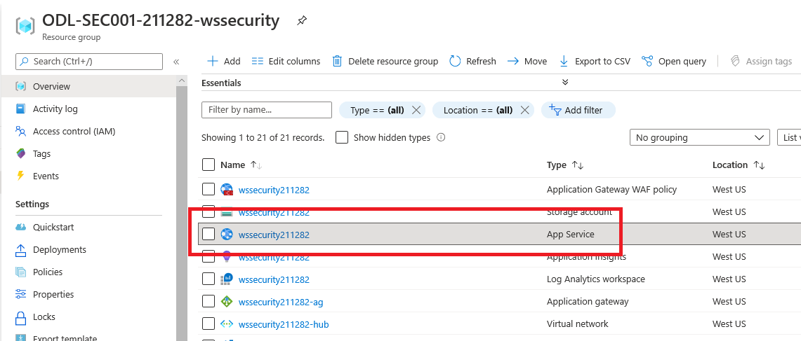

4. On the Overview blade, copy the url of the app service
5. Click the link, it should open in your browser to the public DNS. Record the DNS address.

    

6. In the blade, under **Settings**, select **Networking**
7. Select **Configure your private endpoint connections**

    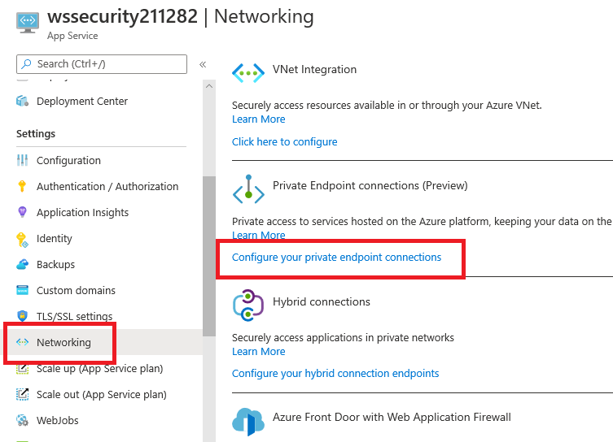

8. Select **+Add**.
9. For the name, type **wssecuritySUFFIX-web-pe**.
10. For the virtual network, select **wssecuritySUFFIX-web**.
11. For the subnet, select **default**.

    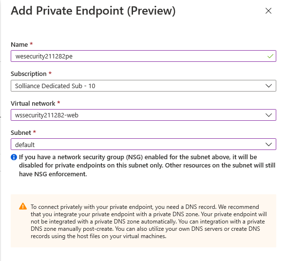

12. Select **OK**.
13. Wait for the operation to complete. Eventually, you should see your new private end point displayed

    

14. Select the new private endpoint.
15. In the end point blade, select **DNS configuration**.
16. Select the **privatelink.azurewebsites.net**
17. Record the IP address for the app service private endpoint

    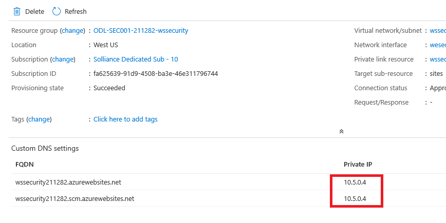

18. Browse to the **Overview** blade, select the app service link again, it should open in your browser and you should get an access denied page

    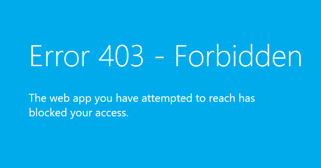

### Task 2: Configure Web Application Firewall (WAF)

1. Switch back to the Azure Portal
2. Browse to the **{wssecuritySUFFIX}-ag** application gateway

    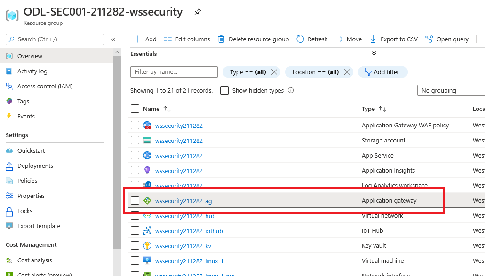

3. Under **Settings**, select **Backend pools**, then select **wssecuritySUFFIXbep**.
4. Update the IP address to point to the new private IP of the web app.

    

5. Select **Save**
6. Select **HTTP settings**, then select the http setting
7. Scroll to the bottom, toggle the **Override with new host name**
8. Type the host name of the web application you recorded above

    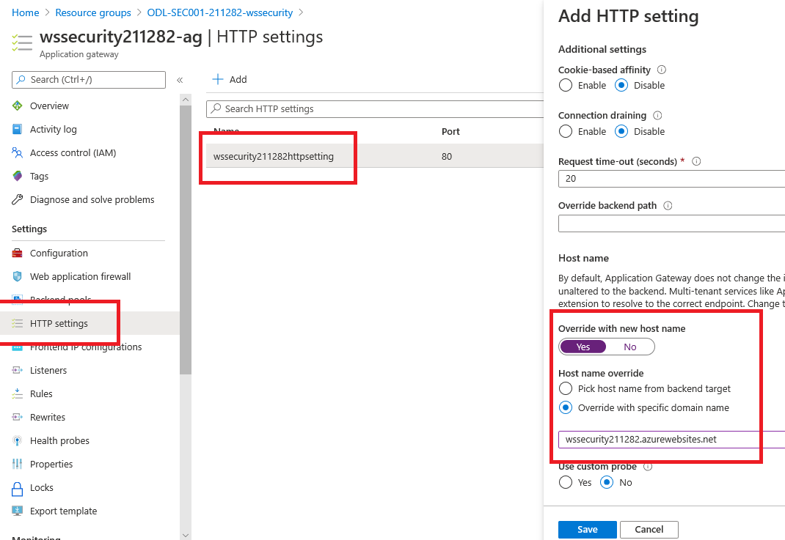

9. Select **Save**
10. Open NotePad++ then open the **c:\windows\system32\drivers\etc\hosts** file, add the following entry replacing the values with the web app gateway public IP and the DNS of the app service:

    ```output
    #APP GATEWAY IP#    #DNS#
    ```

    > **NOTE** You should have an entry already, simply comment it out

11. Save the HOSTS file
12. Select **Overview**, open the public IP address of the web application gateway in a browser window, you should get a connection timeout error.

### Task 3: Setup Virtual Network Peering

1. Select the **wssecuritySUFFIX-web** virtual network

    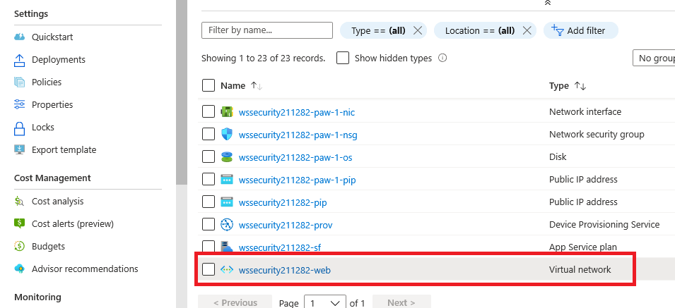

2. Under **Settings**, select **Peerings**
3. Select **+Add**
4. For the first peering link name, type **web_to_hub**
5. For the send peering link name, type **hub_to_web**
6. Select the **wssecuritySUFFIX-hub** virtual network
7. Ensure the **Allow virtual network access...** is enabled for both routes
8. Select **Add**, allow a minute for the configuration to apply
9. Refresh the application gateway IP address in the browser, you should now see your application displayed

### Task 4: Attempt Attack #1

1. Start Fiddler, select **Cancel** if prompted
2. Select **Tools->Options**
3. Select the **HTTPS** tab
4. Select to **Decrypt HTTPS traffic**
5. When prompted, select **Yes** to trust fiddler root certificate through all prompts
6. Select **OK**
7. In a PowerShell ISE window, open the `c:\labfiles\security-workshop\artifacts\WebAttack.ps1` PowerShell script in a PowerShell ISE window
8. Observe the calls to the WAF from fiddler, you should see all the requests make it to the web application even though some fail:

    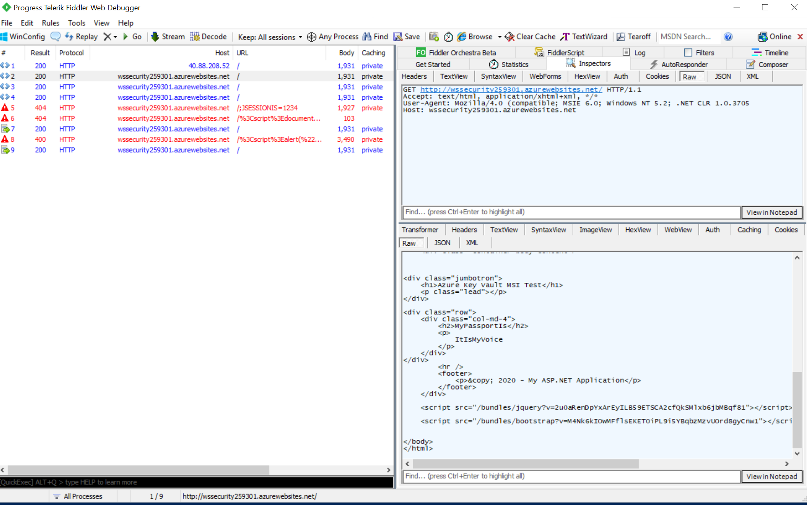

### Task 5: Enable WAF

1. Switch to the Azure Portal
2. Browse to the web application gateway
3. Under **Settings**, select **Web application firewall**
4. Toggle the **Firewall mode** to **Prevention**

    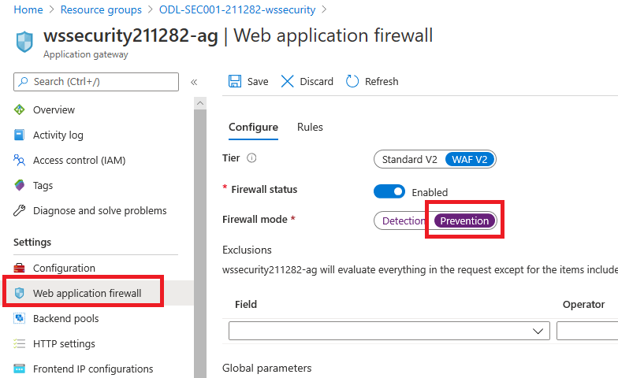

5. Select **Save**

### Task 6: Attempt Attack #2

1. Switch back to the PowerShell ISE window
2. Run the script
3. Observe the calls to the WAF from fiddler, you should see all the requests are prevented from making it to the web application:

    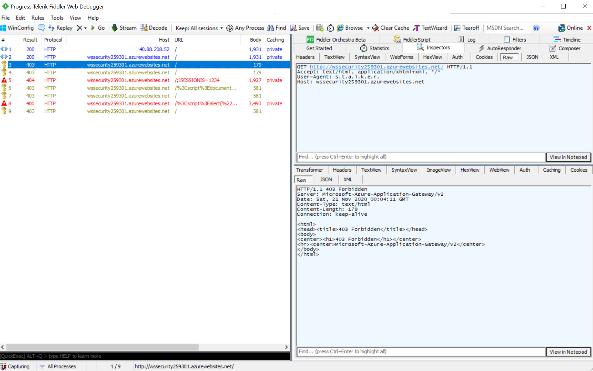

4. Congrats, you have just protected your web application with OWASP rules using Application Gateway!

## Reference Links

- [Private Link](https://docs.microsoft.com/en-us/azure/private-link/private-link-overview)
- [Application Gateway](https://docs.microsoft.com/en-us/azure/application-gateway/overview)
- [Web Application Firewall](https://docs.microsoft.com/en-us/azure/web-application-firewall/ag/ag-overview)
- [OWASP](https://owasp.org/www-community/Web_Application_Firewall)
