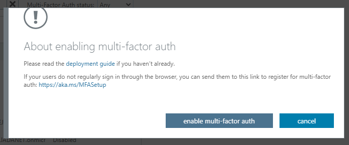
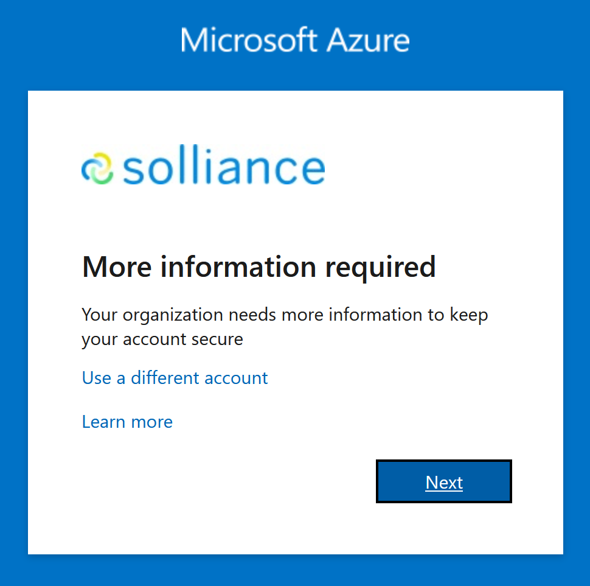
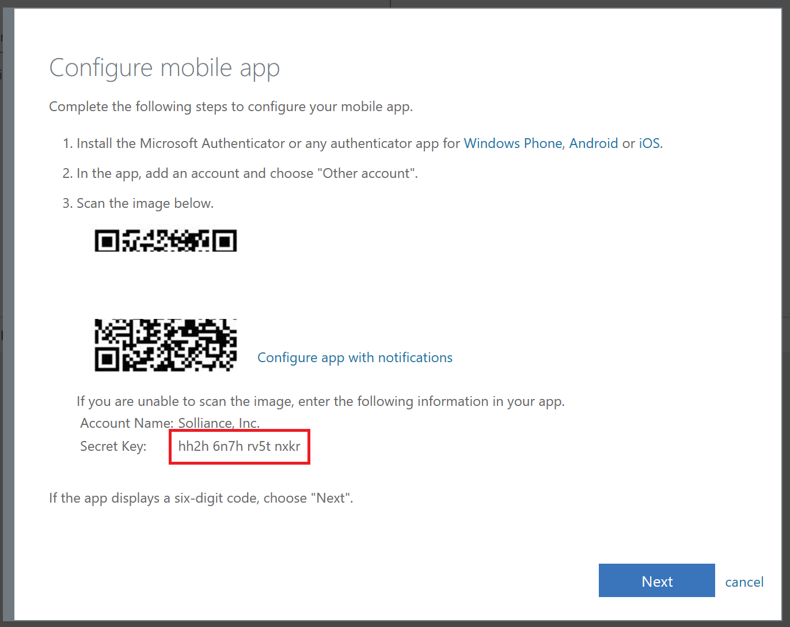
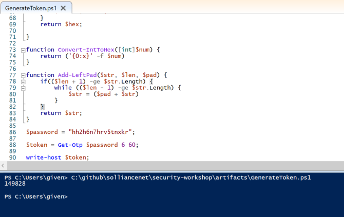

# Day 1 - Lab 6 - Multi-factor Authentication and One Time Passwords (Take home assignment)

DevIntersection Security Workshop

## Exercise 1: How MFA one time token really works

Learn how MFA one time token works.

## Task 1: Generate MFA Password

1. Open your [Azure Active Directory portal](https://account.activedirectory.windowsazure.com/UserManagement/MultifactorVerification.aspx?BrandContextID=O365)
2. Select your account
3. Select **Enable**
4. In the dialog, select **enable multi-factor auth**

    

5. Open a new browser window, login as your user account to the Azure Portal

    

6. Select **Next**

   

7. Select **Mobile App**, then select **Use verification code**
8. Select **Set up**
9. In the dialog, select **Configure app without notifications**

    

10. Copy the code displayed, this is effectively a second password

    

### Task 2: Setup MFA Authenticator App

1. Download the Microsoft Authenticator or Google Authenticator App
2. Scan the bar code displayed, you should see it display the 60 second one time password:

    

### Task 3: Generate code manually

1. Download the `https://raw.githubusercontent.com/solliancenet/security-workshop/master/artifacts/GenerateToken.ps1` Powershell script
2. Open a PowerShell ISE and open the `GenerateToken.ps1`
3. Replace the account value with the secret key you received from the Azure AD Portal
4. Press **F5**, you should see the same value as in your authenticator application

    

    > **NOTE** MFA with Token Generation is really just a second password. If a hacker were to get this second password\secret, they could generate the tokens.

## Exercise 2: Change your SIM Card

### Task 1 : Change your SIM Card (Tmobile)

1. Explore your mobile provider's site, determine how you can change your SIM card.
2. Notice that most allow you to change the card through their portal, if a hacker were to gain your credentials, they can automated the SIM card swap. The next set of steps are for **Tmobile**

    - Open the Tmobile site
    - Login using your credentials
    - Browse 

## Reference Links

- [Azure Active Directory](https://docs.microsoft.com/en-us/azure/active-directory/fundamentals/active-directory-whatis)
- [Azure AD Multi Factor Authentication](https://docs.microsoft.com/en-us/azure/active-directory/authentication/concept-mfa-howitworks)
