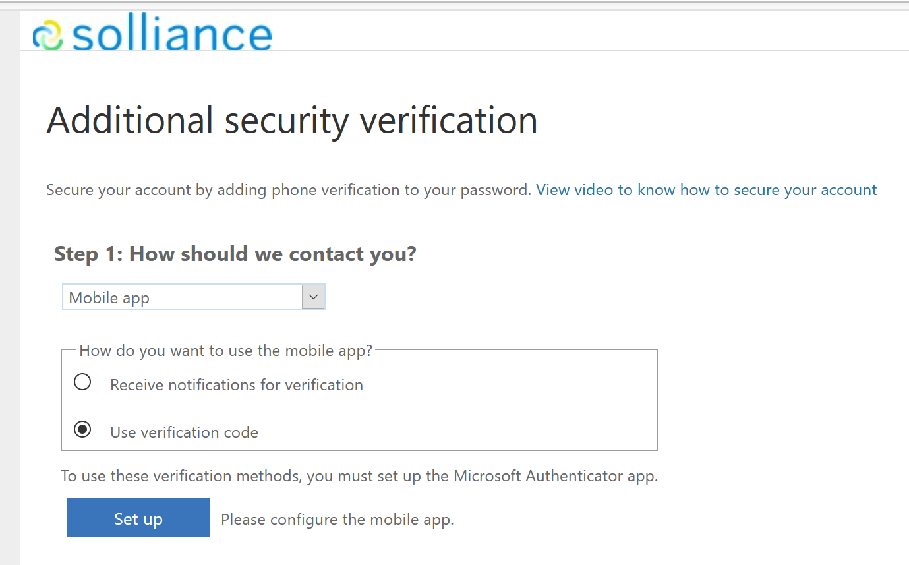
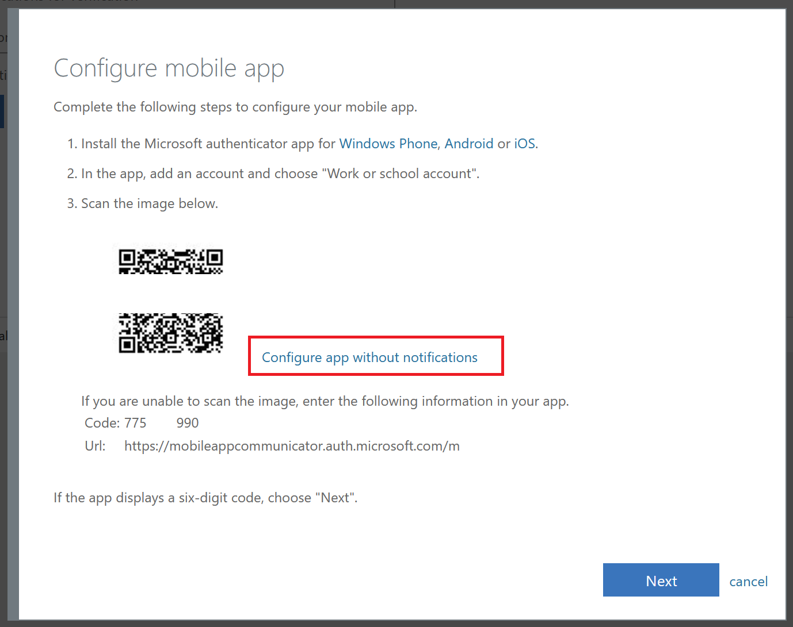
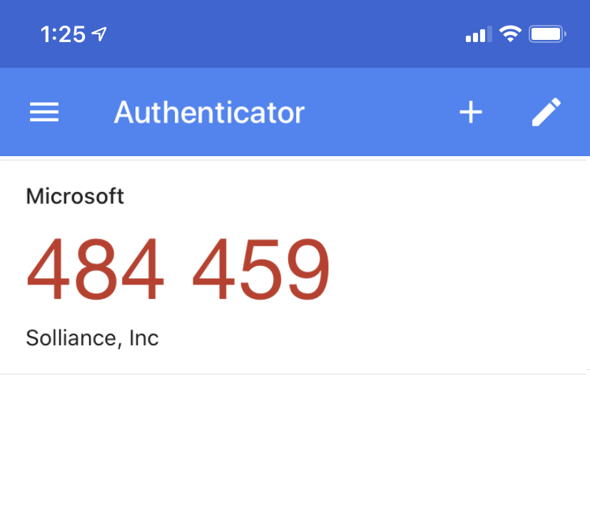
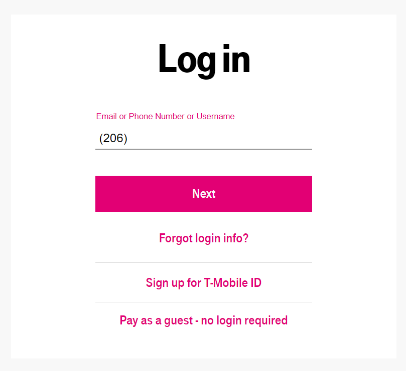
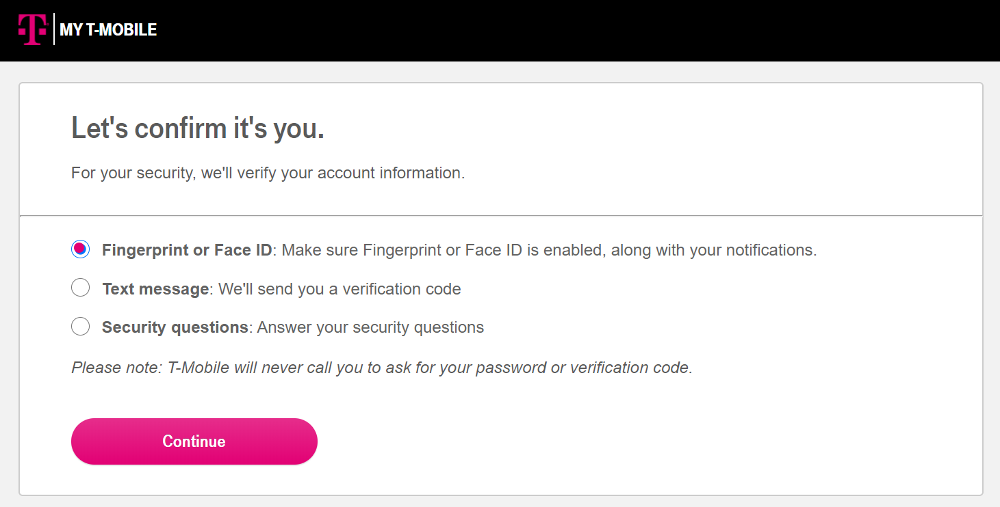
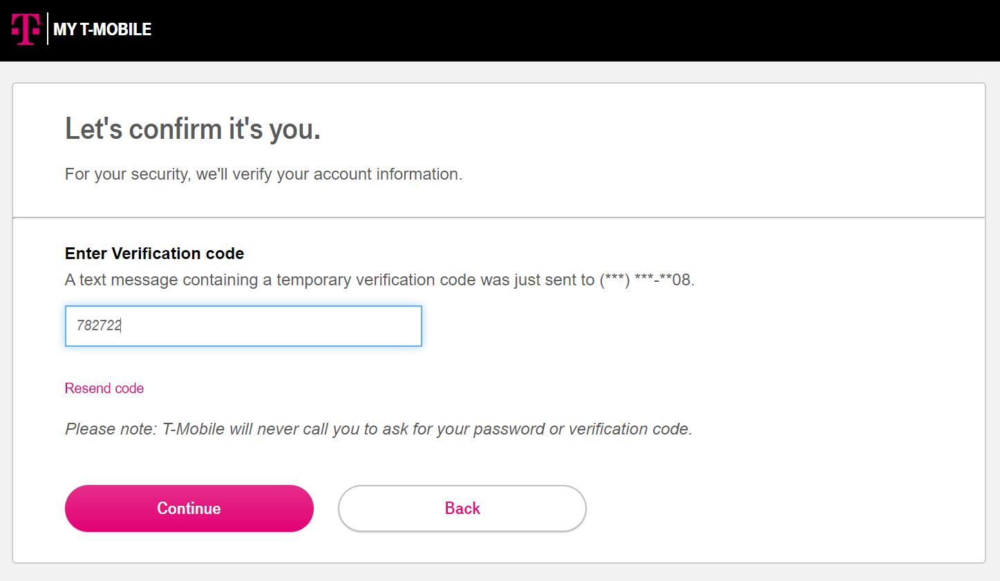
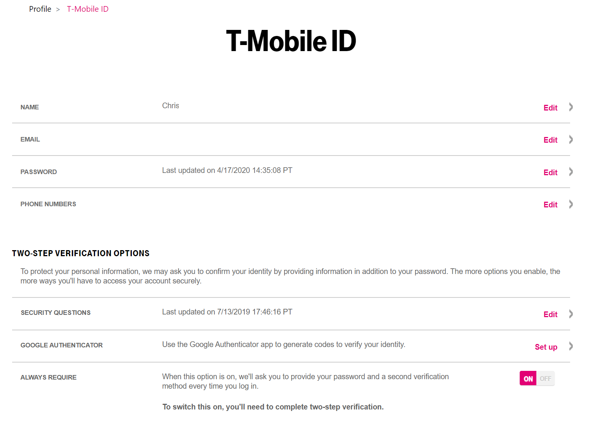
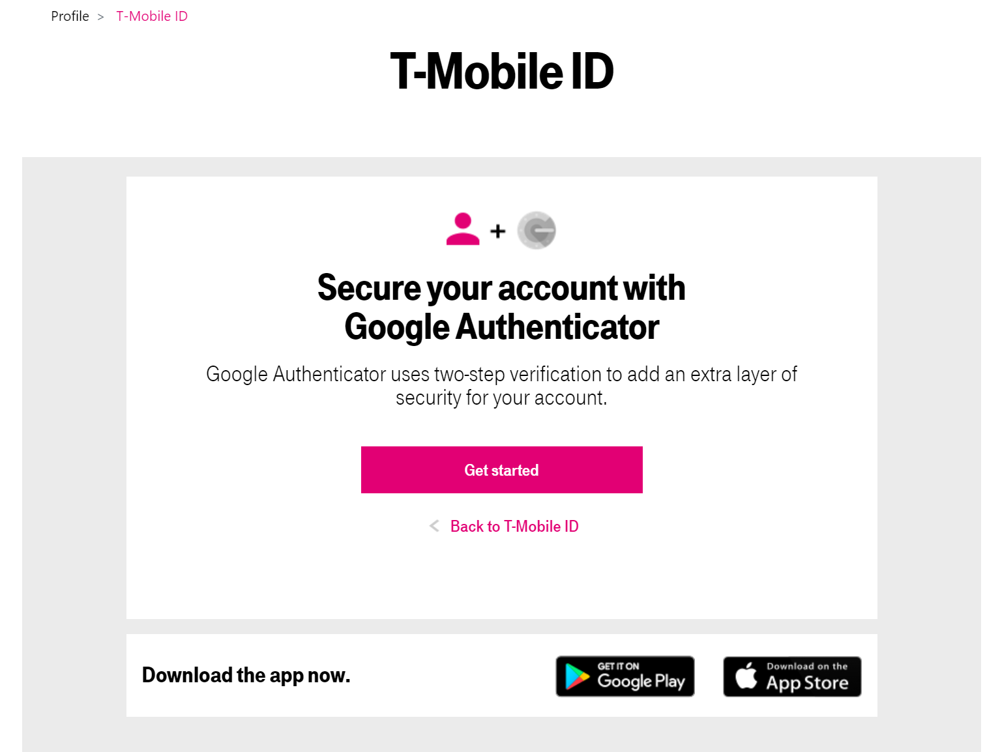
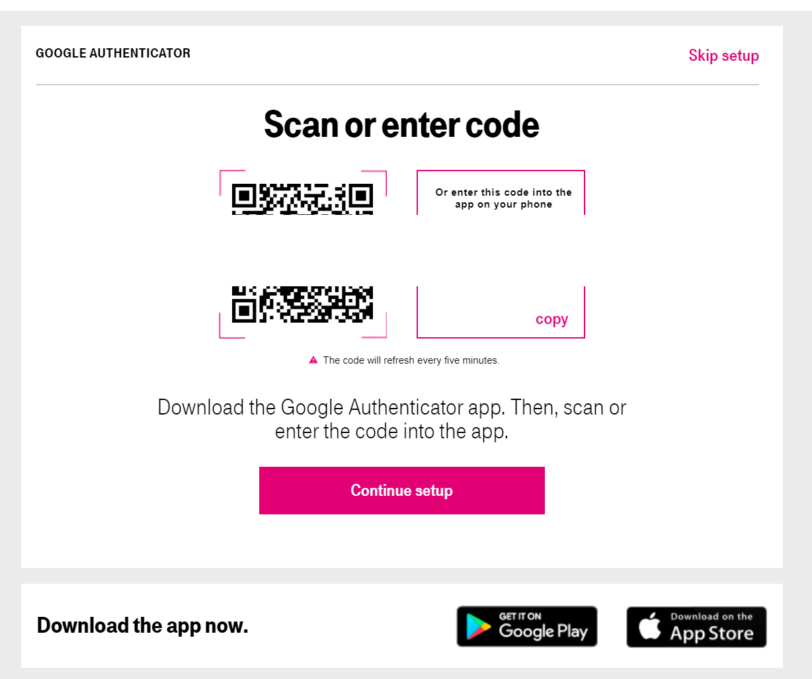
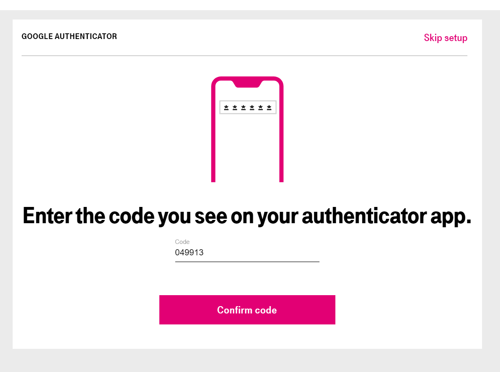

# Day 1 - Lab 6 - Multi-factor Authentication and One Time Passwords (Take home assignment)

DevIntersection Security Workshop

## Exercise 1: How MFA one time token really works

Learn how MFA one time token works.

## Task 1: Generate MFA Password

1. Open your [Azure Active Directory portal](https://account.activedirectory.windowsazure.com/UserManagement/MultifactorVerification.aspx?BrandContextID=O365)
2. Select your account
3. Select **Enable**
4. In the dialog, select **enable multi-factor auth**

    

5. Open a new browser window, login as your user account to the Azure Portal

    

6. Select **Next**

   

7. Select **Mobile App**, then select **Use verification code**
8. Select **Set up**
9. In the dialog, select **Configure app without notifications**

    

10. Copy the code displayed, this is effectively a second password

    

### Task 2: Setup MFA Authenticator App

1. Download the Microsoft Authenticator or Google Authenticator App
2. Scan the bar code displayed, you should see it display the 60 second one time password:

    

### Task 3: Generate code manually

1. Download the `https://raw.githubusercontent.com/solliancenet/security-workshop/master/artifacts/GenerateToken.ps1` Powershell script
2. Open a PowerShell ISE and open the `GenerateToken.ps1`
3. Replace the account value with the secret key you received from the Azure AD Portal
4. Press **F5**, you should see the same value as in your authenticator application

    

    > **NOTE** MFA with Token Generation is really just a second password. If a hacker were to get this second password\secret, they could generate the tokens.

## Exercise 2: Protecting yourself from SIM Card swap

### Task 1 : Change your SIM Card (Tmobile)

1. Explore your mobile provider's site, determine how you can change your SIM card.

2. Notice that most allow you to change the card through their portal, if a hacker were to gain your credentials, they can automated the SIM card swap. The next set of steps are for **TMobile**

3. Open the TMobile site, select **My Account**, then select **Log In**

    

4. Login using your phone number or username and then enter your password
  
    

    > **NOTE** This can be automated and if your password has been `pawned` they can login to your account.

5. If you have setup Multi-factor authentication, you will be prompted for the following. Select **Continue**, then enter your code.

    

    

6. Select **Account**
7. Select the phone line/device
8. Select **Change SIM**
9. At this point a hacker would enter a new SIM card either manually, or via automated means via an HTTP Post

### Task 2 : Setup MFA (Tmobile)

1. Select **My Account**, then select **Profile**
2. Select **T-Mobile ID**
3. On the bottom of the page, for **Google Authenticator** select **Set up**

    

4. If you need too, download the Google Authenticator app. Select **Get Started**

    

5. With the Google Authenticator app, scan the bar code

    

6. Enter the code displayed on your phone

    

7. Congrats, you are now more secure from SIM Card swap attacks!

    > **NOTE** You should attempt to do the same steps with your mobile provider.  If they do not offer two-factor authentication, you should consider switching to another provider.  Additionally, you should call the provider to ensure that no one is allowed to change your SIM card, this includes internal mobile provider employees.

## Reference Links

- [Azure Active Directory](https://docs.microsoft.com/en-us/azure/active-directory/fundamentals/active-directory-whatis)
- [Azure AD Multi Factor Authentication](https://docs.microsoft.com/en-us/azure/active-directory/authentication/concept-mfa-howitworks)
- SIM Swap Attack
- [Verizon Adds Protection Against SIM Swapping Hacks in Mobile App](https://www.vice.com/en_us/article/3azv4y/verizon-sim-swapping-hack-protection-number-lock)
