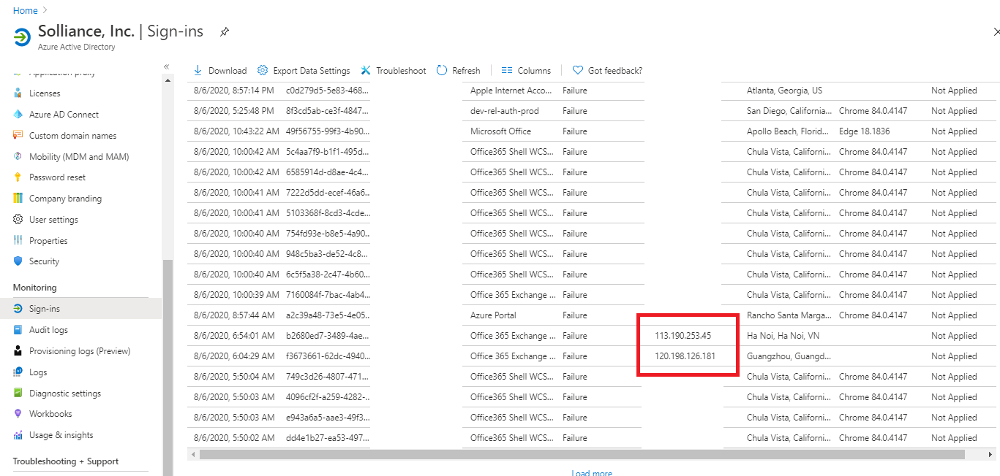
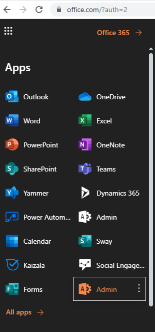
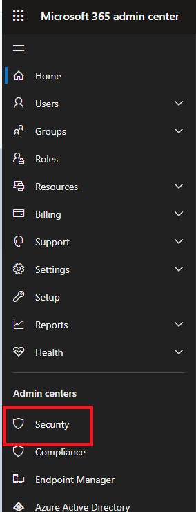
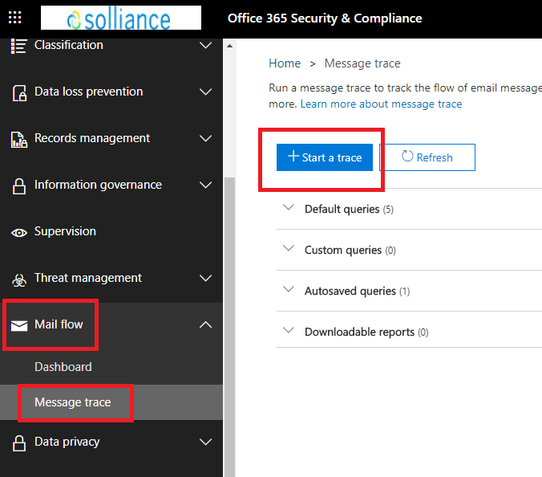
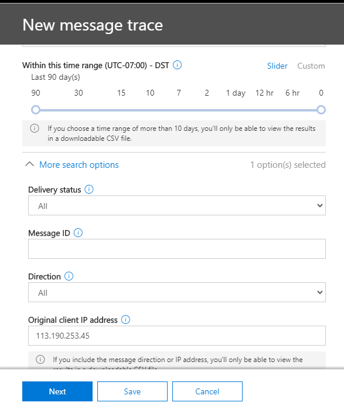

# Day 1 - Lab 6 - Azure and M365 Security (Take home assignment)

DevIntersection Security Workshop

## Exercise 1: Tracing a Hacker

Assume breach, find the hacker.

## Task 1: Azure Active Directory Security

1. Open the Azure Portal (https://portal.azure.com).
2. Select **Azure Active Directory**
3. In the blade, scroll down to the **Monitoring** section, select **Sign-ins**

    

4. Click the **Add filters** button
5. Select **Status**, then select **Apply**
6. Select the new **Status** filter, then select **Failure**
7. Select the **Date** filter, then select **Last 7 days**
8. Review the logs, find an IP address that is not familiar and definitely outside the login range of a user
9. Record the user and the IP address

    

## Task 2: M365 Security

1. Open the Office Admin Portal (https://portal.office.com).

    

2. Under **Admin centers**, select **Security**. You could also go directly to the [M365 Security and Compliance portal](https://protection.office.com/homepage) 

    

3. Under **Mail flow**, select **Message trace**.
4. Select **Start a trace**

    

5. For the **By these people**, select the same user as you recorded above.
6. For the time range, select **90** days
7. Expand the **More search options**
8. For the Original client IP address, type the IP Address from above

    

9. Expand the **Choose report type**
10. Select **Extended Report**
11. Select **Next**
12. Select **Prepare report**

    > **NOTE**  This will run a report looking for any emails that were sent from the suspect IP address.  You can also remove the IP Address if needed to see any email traffic that does not match the user's regular IP address

## Reference Links

- [Azure Active Directory](https://docs.microsoft.com/en-us/azure/active-directory/fundamentals/active-directory-whatis)
- [M365 Message Trace](https://docs.microsoft.com/en-us/microsoft-365/security/office-365-security/message-trace-scc?view=o365-worldwide)
- [M356 eDiscovery](https://docs.microsoft.com/en-us/microsoft-365/compliance/ediscovery?view=o365-worldwide)
